# OxiGDAL

**Pure Rust Geospatial Data Abstraction Library — Production-Grade GDAL Alternative**

[](https://crates.io/crates/oxigdal)
[](https://docs.rs/oxigdal)
[](https://www.rust-lang.org/)
[](LICENSE)
[](https://github.com/cool-japan)

> **Note:** OxiGDAL is being renamed to **OxiGeo**. v0.1.7 is the final release under the OxiGDAL name; development continues as OxiGeo from v0.2.0. This project is an independent reimplementation and is not affiliated with the GDAL project.

[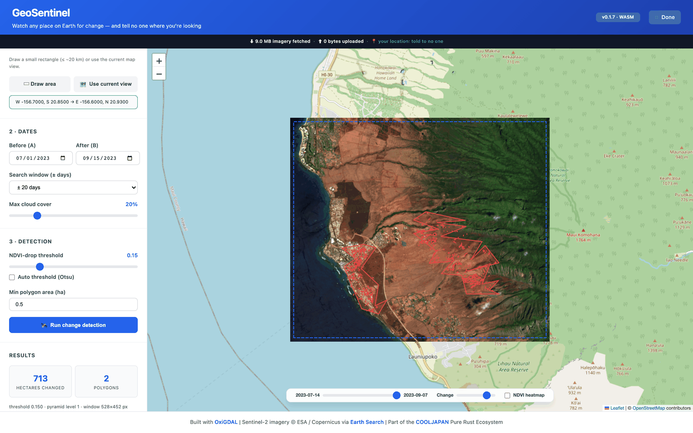](https://cooljapan.tech/geosentinel/)

**GeoSentinel**: watch any place on Earth for change — and tell no one where you're looking. It searches the public Earth Search STAC API for a cloud-filtered Sentinel-2 scene pair, streams only the needed COG windows via HTTP range requests, and runs the whole change-detection pipeline — NDVI difference, thresholding, polygonization, geodesic areas, GeoJSON export — 100% client-side in Pure-Rust WebAssembly; your area of interest never leaves your machine. **[Try it live](https://cooljapan.tech/geosentinel/)** — one of **four** hosted [demos](#demos) below, alongside [GeoLab](#geolab--terrain-analysis-on-streamed-cogs), [GeoVault](#geovault--sovereign-clean-room-workstation), and [GeoParquet Live](#geoparquet-live--query-59-gb-with-no-database).

OxiGDAL is a comprehensive, production-ready geospatial data abstraction library written in **100% Pure Rust** with zero C/C++/Fortran dependencies in default features. **v0.1.7** completed production-hardening validation on 2026-07-20 (v0.1.6 released 2026-06-15; 0.1.7 has not yet been published to crates.io — publication is a separate, not-yet-taken step), and delivers ~747K Rust SLoC across **76 workspace crates**, covering 17 geospatial format drivers, full CRS transformations, raster/vector algorithms, cloud-native I/O, GPU acceleration, enterprise security, and cross-platform bindings (Python, Node.js, WASM, iOS, Android).

## Project Statistics

| Metric | Value |
|--------|-------|
| **Version** | 0.1.7 (production-hardening validation complete 2026-07-20; not yet published — v0.1.6 released 2026-06-15) |
| **Rust SLoC** | ~747K across 2,448 `.rs` files (via `tokei`) |
| **Total SLoC** | ~785K (all languages, via `tokei`) |
| **Workspace crates** | 76 |
| **Tests** | 16,909 passing (85 skipped), 0 failures; 409 doc tests passing |
| **Format drivers** | 17 (GeoTIFF/COG, GeoJSON, GeoParquet, Zarr, FlatGeobuf, Shapefile, NetCDF, HDF5, GRIB, JPEG2000, VRT, COPC/LAS, GeoPackage, MBTiles, PMTiles, KML, TopoJSON) |
| **EPSG definitions** | 211+ embedded (all UTM zones, national grids), O(1) lookup |
| **Map projections** | 20+ (UTM 1-60, Web Mercator, LCC, Albers, Polar Stereo, Japan Plane Rect, ...) |
| **Supported platforms** | Linux, macOS, Windows, WASM, iOS, Android, embedded (no_std) |
| **Estimated dev cost** | $29.59M equivalent (COCOMO) |

## Why OxiGDAL?

| | GDAL (C/C++) | OxiGDAL (Rust) |
|---|---|---|
| **Dependencies** | C/C++ toolchain, PROJ, GEOS, libcurl, ... | `cargo add oxigdal` |
| **Cross-compilation** | Complex per-target | Trivial (WASM, iOS, Android, embedded) |
| **Memory safety** | Manual management | Guaranteed by Rust |
| **Concurrency** | Thread-unsafe APIs | Fearless concurrency |
| **Binary size** | ~50MB+ monolith | Pay-for-what-you-use features |
| **WASM** | Not supported | < 1MB gzipped bundle |
| **Error handling** | C error codes | Rich typed `Result<T, OxiError>` |
| **Async I/O** | Blocking only | First-class async |

## Quick Start

```toml
[dependencies]
oxigdal = "0.1"  # GeoTIFF + GeoJSON + Shapefile by default

# Full feature set:
oxigdal = { version = "0.1", features = ["full"] }
```

```rust
use oxigdal::Dataset;

fn main() -> oxigdal::Result<()> {
    let dataset = Dataset::open("world.tif")?;
    println!("Format : {}", dataset.format());
    println!("Size   : {}x{}", dataset.width(), dataset.height());
    println!("CRS    : {}", dataset.crs().unwrap_or("unknown"));
    Ok(())
}
```

## Demos

Four live, hosted demos — each one runs 100% client-side: Pure-Rust WebAssembly
in your browser tab, no server-side processing, no accounts, no telemetry.

| Demo | One-liner | Live |
|------|-----------|------|
| **GeoLab** | Stream, decode, and terrain-analyze Cloud-Optimized GeoTIFFs | [cooljapan.tech/geolab](https://cooljapan.tech/geolab/) |
| **GeoSentinel** | Watch any place on Earth for change — and tell no one where you're looking | [cooljapan.tech/geosentinel](https://cooljapan.tech/geosentinel/) |
| **GeoVault** | A clean-room workstation that seals a signed, tamper-evident ledger of everything it did | [cooljapan.tech/geovault](https://cooljapan.tech/geovault/) |
| **GeoParquet Live** | Query a dataset bigger than your laptop, over the network, with no database | [cooljapan.tech/geoparquet](https://cooljapan.tech/geoparquet/) |

### GeoLab — terrain analysis on streamed COGs

The [GeoLab](https://cooljapan.tech/geolab/) viewer is a Pure-Rust WebAssembly
build of the raster pipeline — GeoTIFF decode, `combined_hillshade`, and colormap
rendering all run in the browser tab, not on a server.

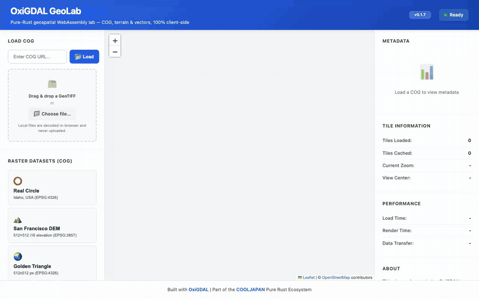

Hosted, nothing to install: **[cooljapan.tech/geolab](https://cooljapan.tech/geolab/)**

Or run it locally (builds the WASM module, then serves the static demo):

```sh
cd crates/oxigdal-wasm
wasm-pack build --scope cooljapan --target web --out-dir pkg --release
cd ../../demo/cog-viewer
python3 -m http.server 8080
# open http://localhost:8080
```

#### Native-render gallery

The same algorithms, invoked directly from Rust (no browser, no WASM) against the
San Francisco / Marin Headlands SRTM DEM:

<table>
<tr>
<td align="center">
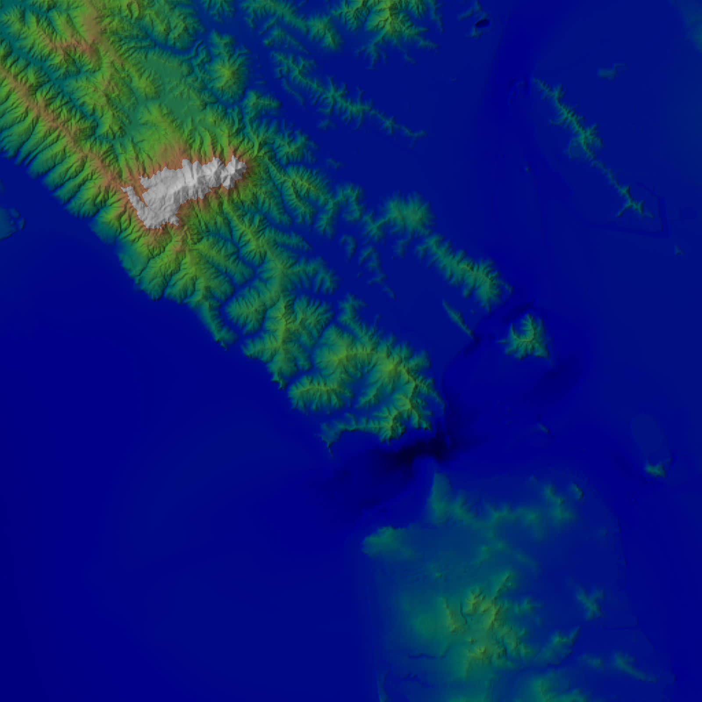<br>
<sub><code>combined_hillshade</code> × <code>Colormap::Terrain</code></sub>
</td>
<td align="center">
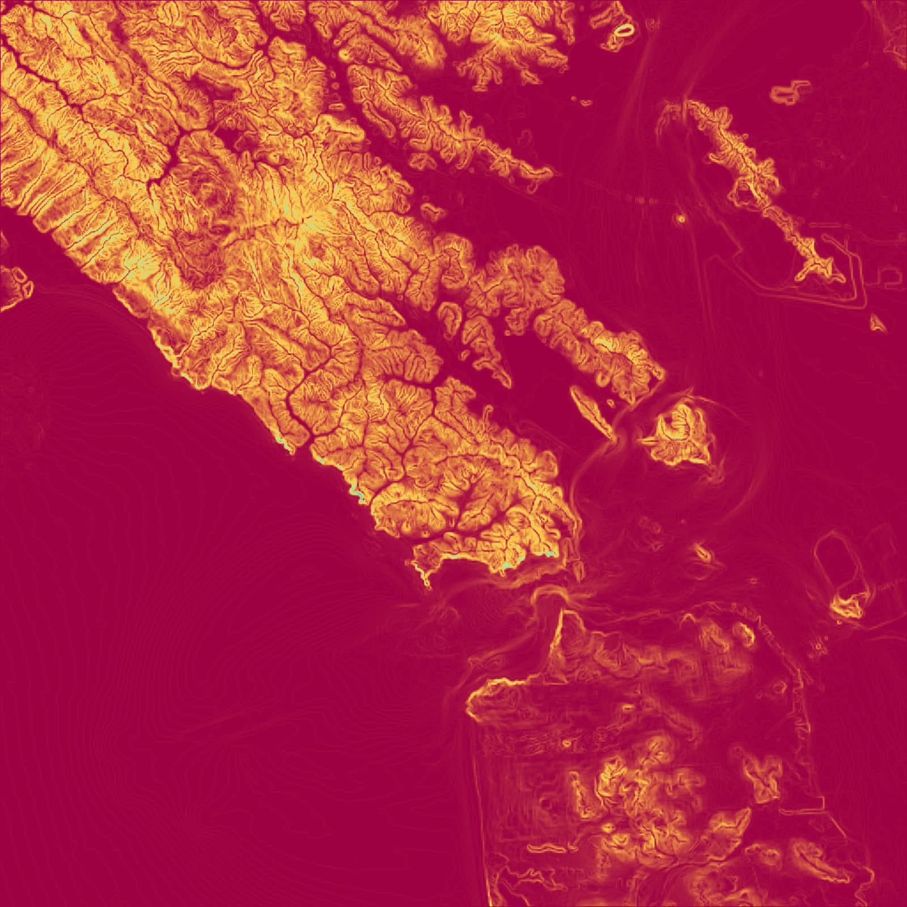<br>
<sub><code>slope()</code> × <code>Colormap::Spectral</code></sub>
</td>
</tr>
<tr>
<td align="center">
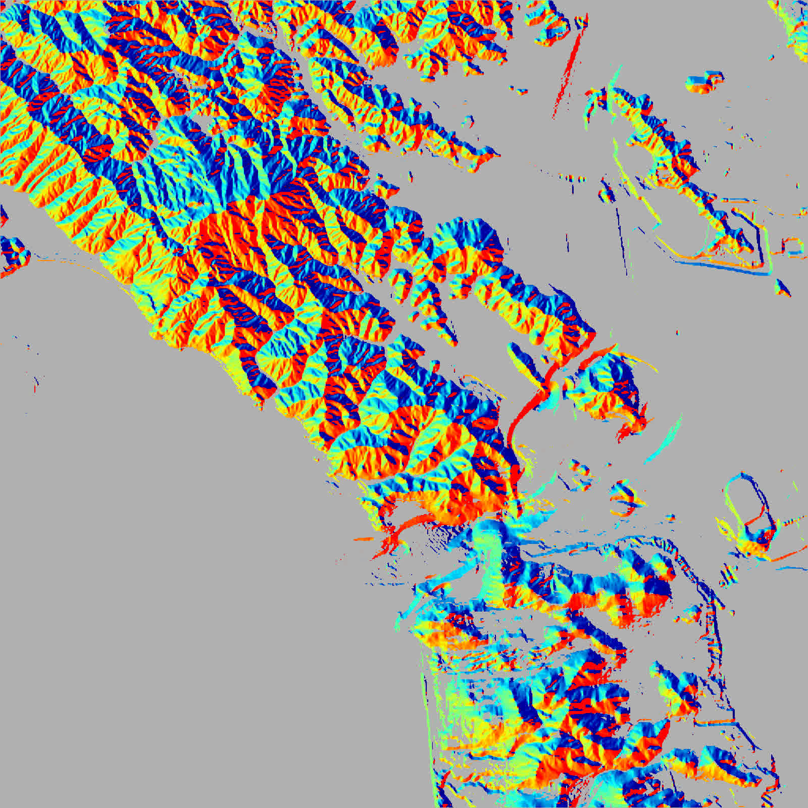<br>
<sub><code>aspect()</code> masked by <code>slope()</code> × <code>Colormap::Jet</code></sub>
</td>
<td align="center">
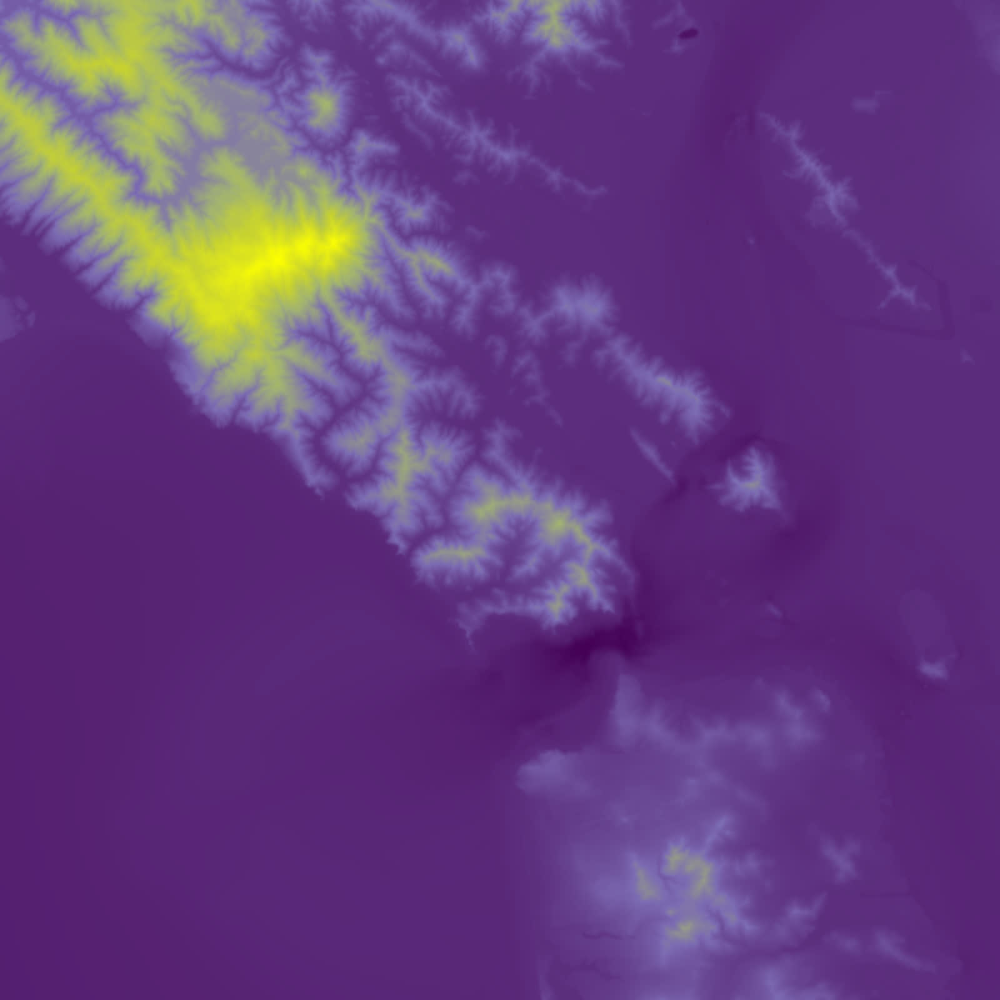<br>
<sub>elevation × <code>Colormap::Viridis</code></sub>
</td>
</tr>
</table>

> Every image on this page — the hero screenshots, the interaction GIFs, the
> demo galleries, and the four native renders above — is a real capture or
> render produced by this repository's own code, not a mockup. Reproduce the
> native gallery yourself with:
> `cargo run -p oxigdal-server --example render_hero --release -- --mode all`

### GeoSentinel — in-browser Sentinel-2 change detection

[](https://cooljapan.tech/geosentinel/)

**Watch any place on Earth for change — and tell no one where you're looking.**
GeoSentinel searches the public Earth Search STAC API for a cloud-filtered
Sentinel-2 L2A scene pair, streams only the needed COG windows (red + NIR
bands) via HTTP range requests, and runs the whole change-detection pipeline —
NDVI difference, fixed or Otsu thresholding, polygonization, Karney geodesic
areas, GeoJSON export — inside WebAssembly. **[Try it live](https://cooljapan.tech/geosentinel/)**

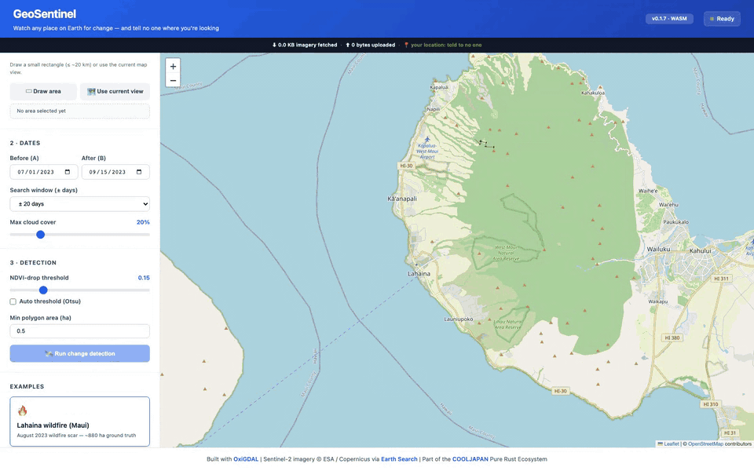

Hosted, nothing to install: **[cooljapan.tech/geosentinel](https://cooljapan.tech/geosentinel/)**

Or run it locally (builds the WASM package if missing, then serves the demo):

```sh
cd demo/geosentinel
./run.sh
# open http://localhost:8080
```

<table>
<tr>
<td align="center">
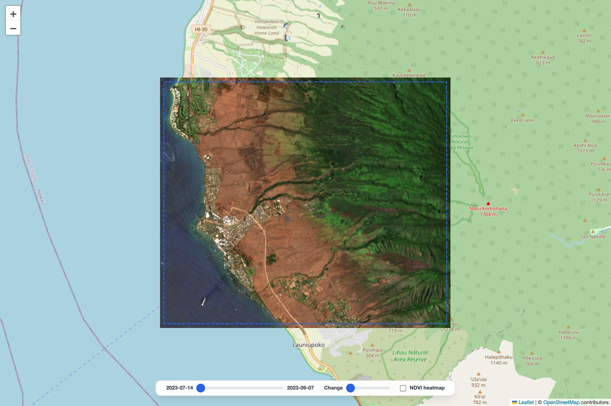<br>
<sub>Scene A — true color (before)</sub>
</td>
<td align="center">
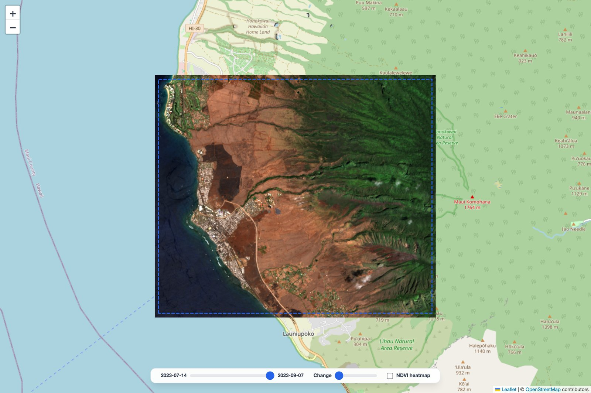<br>
<sub>Scene B — true color (after)</sub>
</td>
</tr>
<tr>
<td align="center">
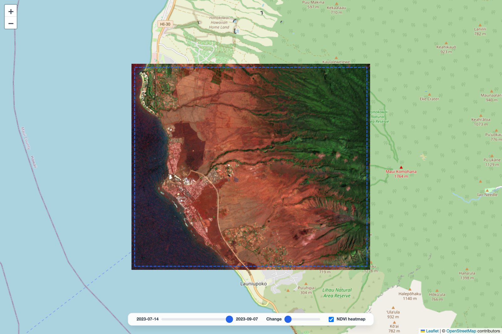<br>
<sub>NDVI-drop heatmap (red = vegetation loss)</sub>
</td>
<td align="center">
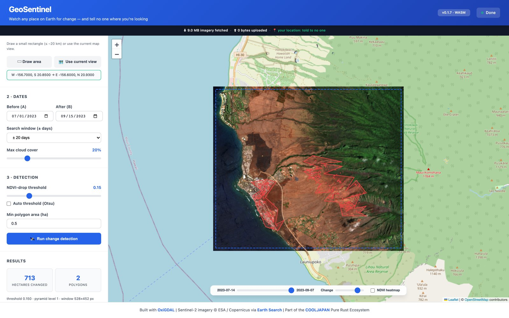<br>
<sub>Change polygons + geodesic hectares (GeoJSON export)</sub>
</td>
</tr>
</table>

> **Honest notes** — the analysis (NDVI, thresholding, polygonization,
> geodesic areas) runs locally in your tab; the Sentinel-2 imagery is streamed
> directly from the AWS open-data bucket (`sentinel-cogs` S3, found via the
> public Earth Search STAC API); your location and area of interest are never
> sent to any backend of ours — there isn't one. Verified example: the Lahaina
> wildfire preset detects **713 ha** of burn scar (≈880 ha ground truth) from
> **9.0 MB** of streamed imagery.

### GeoVault — sovereign clean-room workstation

[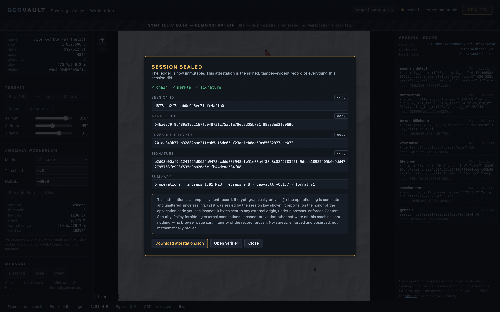](https://cooljapan.tech/geovault/)

**Analyze sensitive terrain data in a browser clean-room that can prove its
session log afterwards.** Every operation is appended to a blake3 hash chain,
rolled up into a Merkle root, and sealed with an Ed25519 signature — producing
a downloadable attestation that an independent verifier page (or a native Rust
example) re-checks from the JSON alone, while a strict Content-Security-Policy
forbids every external connection during the session.
**[Try it live](https://cooljapan.tech/geovault/)**

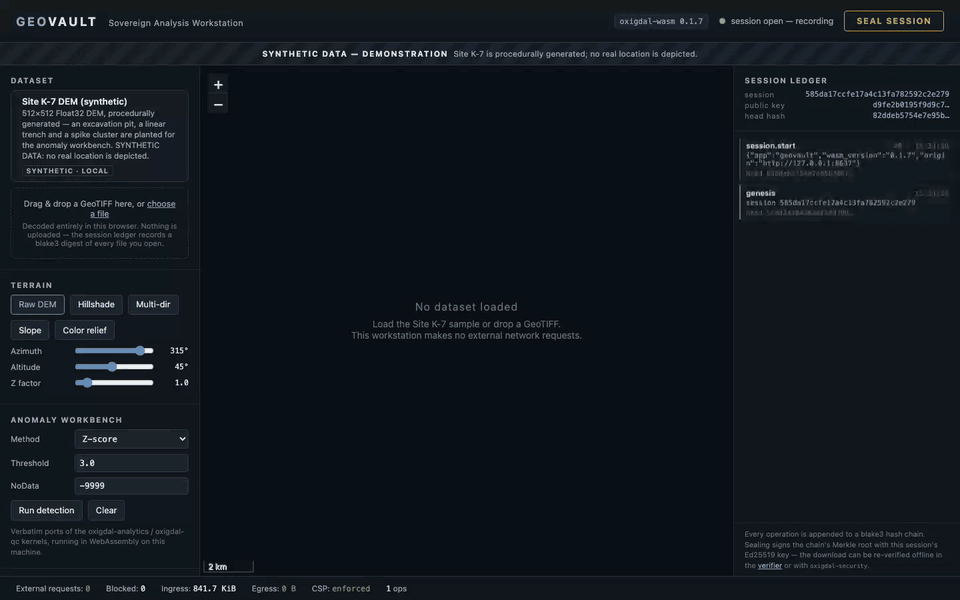

Hosted, nothing to install: **[cooljapan.tech/geovault](https://cooljapan.tech/geovault/)**

Or run it locally (shares the GeoLab/GeoSentinel WASM package):

```sh
wasm-pack build crates/oxigdal-wasm --target web --out-dir pkg   # once, from repo root
cd demo/geovault
python3 -m http.server 8080
# open http://localhost:8080
```

<table>
<tr>
<td align="center">
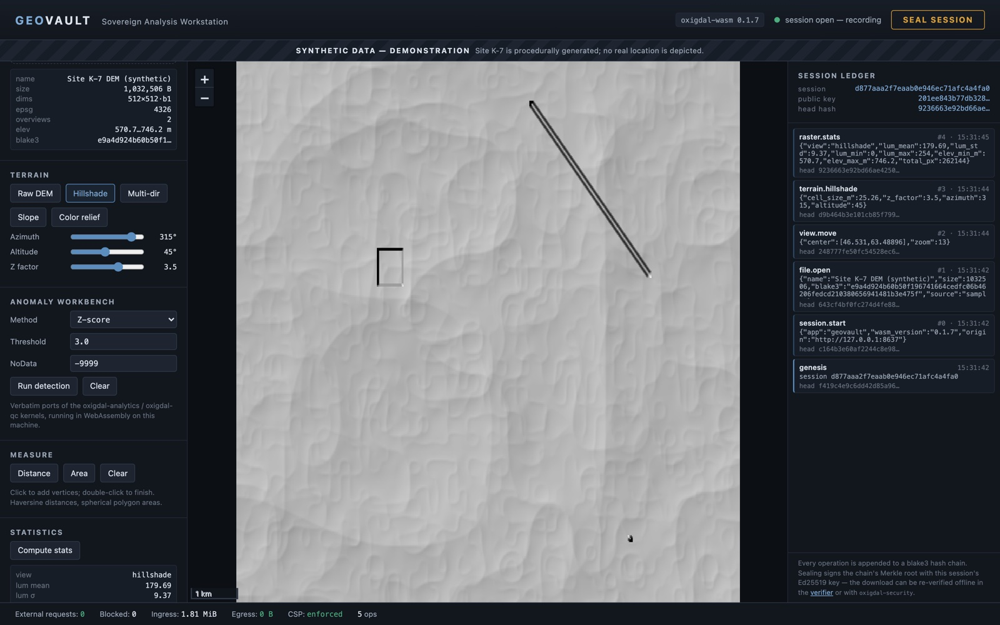<br>
<sub>Workstation — every action lands in the session ledger</sub>
</td>
<td align="center">
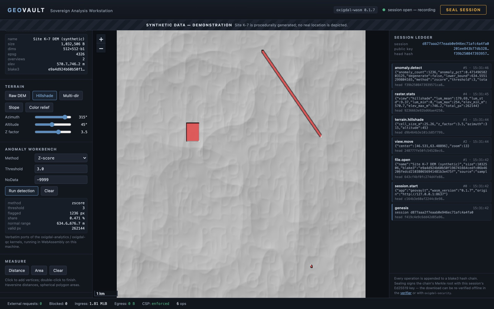<br>
<sub>Anomaly detection (Z-score / IQR / modified-Z)</sub>
</td>
</tr>
<tr>
<td align="center">
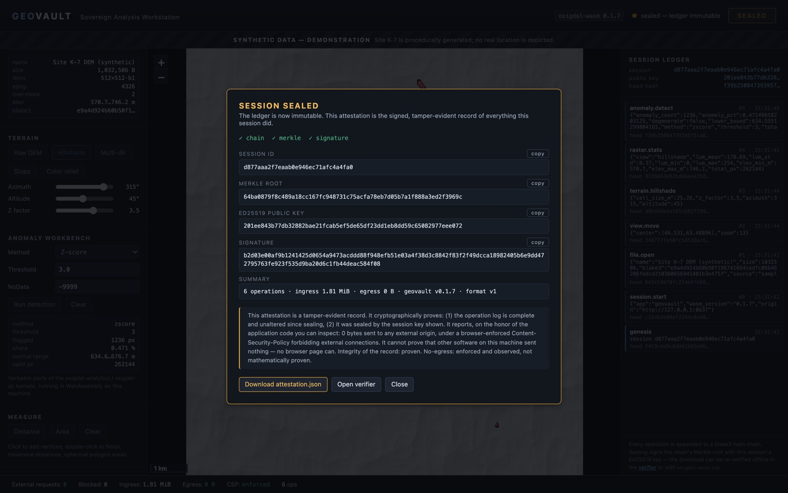<br>
<sub>Seal session — Merkle root + Ed25519 signature</sub>
</td>
<td align="center">
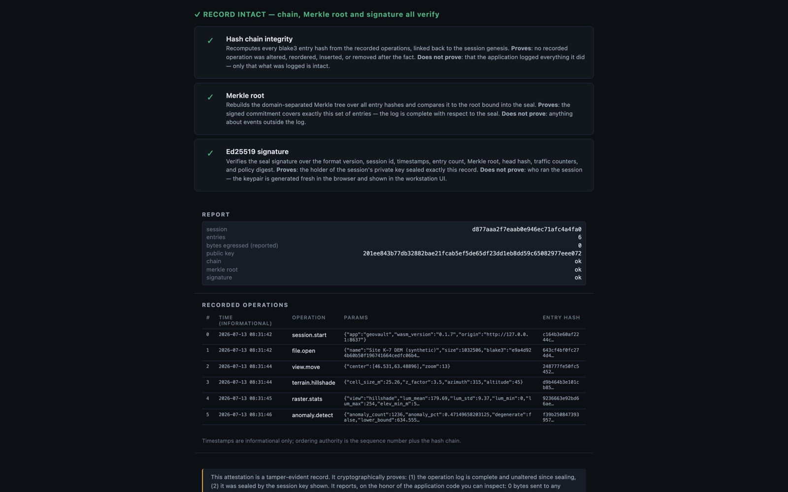<br>
<sub>Independent verifier — chain ✓ · root ✓ · signature ✓</sub>
</td>
</tr>
</table>

> **Trust model, stated honestly** — the attestation cryptographically proves
> that the recorded operation log is complete and unaltered since sealing
> (blake3 chain → Merkle root → Ed25519 seal); the zero-egress claim is
> **enforced** by a browser Content-Security-Policy and **observed** by
> in-page fetch/XHR/beacon hooks — it is not mathematically proven, because no
> browser page can prove what other software on the machine did. Log
> integrity: proven. No-egress: enforced and observed.

### GeoParquet Live — query 5.9 GB with no database

[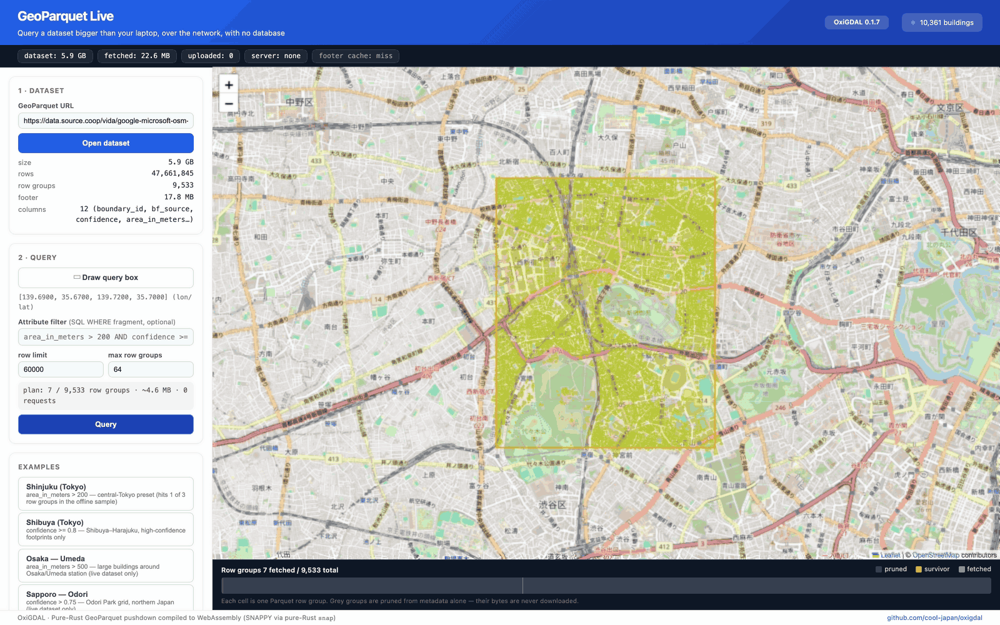](https://cooljapan.tech/geoparquet/)

**Query a dataset bigger than your laptop, over the network, with no
database.** The browser points at the VIDA Japan building-footprints
GeoParquet — **5.9 GB, 47.66 million rows, 9,533 row groups** — and answers
bounding-box + attribute queries by downloading only the byte ranges that
survive metadata pruning: the Shinjuku preset prunes 9,533 row groups down to
**7 survivors**, fetches **4.7 MB** of column chunks, and refines the exact
matches in **13 ms**. **[Try it live](https://cooljapan.tech/geoparquet/)**

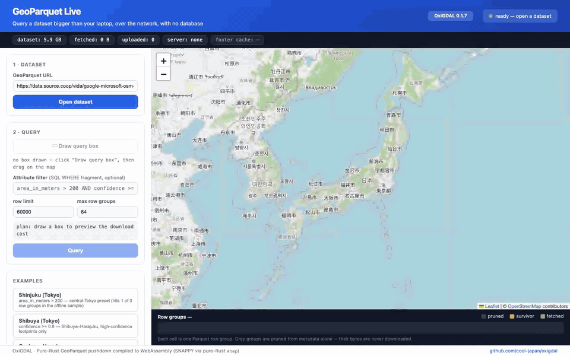

Hosted, nothing to install: **[cooljapan.tech/geoparquet](https://cooljapan.tech/geoparquet/)**

Or run it locally (`serve.py` answers HTTP Range requests with `206`, which
stock `python3 -m http.server` does not):

```sh
cd demo/geoparquet
./build.sh              # wasm-pack build of crates/oxigdal-wasm-geoparquet (once)
python3 serve.py 8080
# open http://127.0.0.1:8080
```

<table>
<tr>
<td align="center">
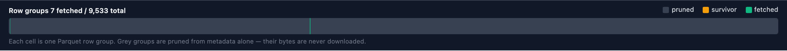<br>
<sub>All 9,533 row groups — grey pruned · amber survivors · green fetched</sub>
</td>
<td align="center">
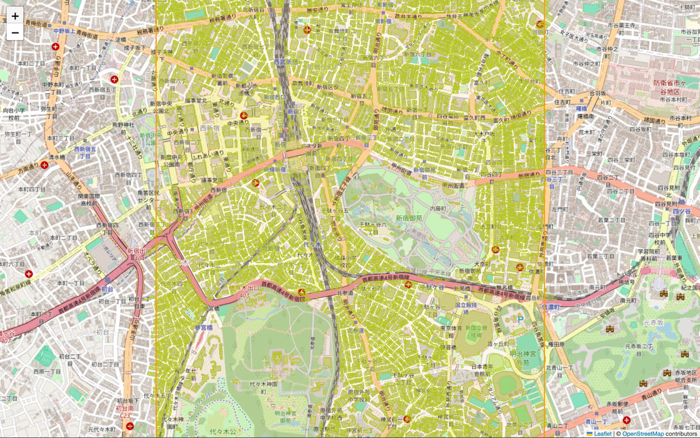<br>
<sub>Confidence-colored footprints on a Leaflet canvas</sub>
</td>
</tr>
<tr>
<td align="center" colspan="2">
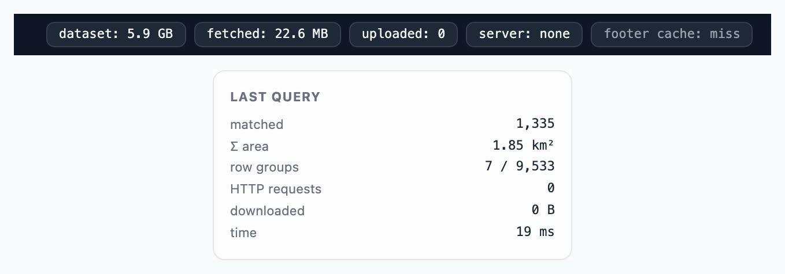<br>
<sub><code>dataset: 5.9 GB · fetched: N MB · uploaded: 0 · server: none</code></sub>
</td>
</tr>
</table>

> **Honest notes** — the 17.8 MB Parquet footer is fetched once, on first open
> only (the browser Cache API serves it on later visits); snappy-compressed
> GeoParquet is supported via the pure-Rust `snap` codec, while zstd-compressed
> files are not — no pure-Rust parquet zstd path exists yet (documented
> limitation); `plan()` previews row groups / bytes / request count before a
> single data byte is fetched, and over-broad queries are refused rather than
> silently downloaded.

## Architecture

76 workspace crates organized into functional layers:

```
Core & Algorithms
  oxigdal                    Umbrella crate (unified API entry-point)
  oxigdal-core               Types, traits, async I/O, Arrow buffers, no_std core
  oxigdal-proj               Pure Rust PROJ: 20+ projections, 211+ EPSG, WKT2
  oxigdal-algorithms         SIMD raster/vector algorithms (AVX2, AVX-512, NEON)
  oxigdal-index              Spatial indexing (R-tree, grid, geometry validation/operations)
  oxigdal-qc                 Data validation, anomaly detection, quality scoring

Format Drivers (16 formats)
  geotiff      GeoTIFF/COG   BigTIFF, HTTP range, overviews, DEFLATE/LZW/ZSTD/JPEG
  geojson      GeoJSON       RFC 7946, streaming parser, GeoArrow zero-copy
  geoparquet   GeoParquet    Arrow native, spatial predicate pushdown, 10x faster
  zarr         Zarr v2/v3    Sharding, codec pipeline, consolidated metadata
  flatgeobuf   FlatGeobuf    Packed Hilbert R-tree, spatial filter during decode
  shapefile    Shapefile     SHP/SHX/DBF, full attribute table support
  netcdf       NetCDF        CF conventions, unlimited dims, root group (pure-Rust oxinetcdf)
  hdf5         HDF5          Hierarchical, attributes, real read/write (pure-Rust oxih5)
  grib         GRIB1/2       Meteorological parameter/level tables
  jpeg2000     JPEG2000      Wavelet DWT, full EBCOT tier-1 decoder (MQ coder, 3-pass)
  vrt          VRT           Band math, source mosaicking, on-the-fly processing
  copc         COPC/LAS      Cloud Optimized Point Cloud (LAS 1.4, octree)
  gpkg         GeoPackage    SQLite-based, vector features + tiles
  mbtiles      MBTiles       Tile storage, TMS/XYZ schemes
  pmtiles      PMTiles v3    Hilbert curve, single-file tile archive
  geojson-s    GeoJSON (streaming)  Streaming GeoJSON parser/writer/filter

Cloud & Storage
  oxigdal-cloud              S3 / GCS / Azure Blob backends with HTTP range support
  oxigdal-cloud-enhanced     Multi-cloud orchestration, auto-tiering
  oxigdal-drivers-advanced   Multi-part S3, ADLS, GCS optimized reads
  oxigdal-compress           OxiArc compression: Deflate, LZ4, Zstd, BZip2, LZW
  oxigdal-cache-advanced     Multi-tier: in-memory LRU -> disk -> Redis
  oxigdal-rs3gw              Rust S3-compatible gateway

Domain Modules
  oxigdal-3d                 3D Tiles 1.0 (B3DM, I3DM, PNTS), glTF, Delaunay
  oxigdal-terrain            DEM, hydrology, viewshed, TRI/TPI, watershed
  oxigdal-temporal           Time-series datacube, change detection, gap filling
  oxigdal-analytics          Spatial stats, Getis-Ord Gi*, clustering, zonal ops
  oxigdal-sensors            IoT sensor ingestion, calibration, SOS
  oxigdal-metadata           ISO 19115:2014, ISO 19139 XML, FGDC CSDGM
  oxigdal-stac               SpatioTemporal Asset Catalog 1.0.0 client
  oxigdal-query              SQL-like geospatial query engine with optimizer

Enterprise & Infrastructure
  oxigdal-server             OGC server: WMS 1.3.0, WFS 2.0.0
  oxigdal-gateway            API gateway: JWT, OAuth2, rate limiting
  oxigdal-security           AES-256-GCM, ChaCha20-Poly1305, Argon2id, RBAC/ABAC
  oxigdal-observability      Prometheus metrics, OpenTelemetry tracing, alerting
  oxigdal-services           WMS/WFS endpoints, health checks
  oxigdal-workflow           Workflow automation and scheduling
  oxigdal-distributed        Distributed partitioning and sharding
  oxigdal-cluster            Raft consensus-based cluster coordination
  oxigdal-ha                 High-availability failover and leader election
  oxigdal-postgis            PostGIS connector
  oxigdal-db-connectors      PostgreSQL, SQLite, DuckDB connectors

Streaming & Messaging
  oxigdal-streaming          Real-time stream processing
  oxigdal-kafka              Apache Kafka integration
  oxigdal-kinesis            AWS Kinesis integration
  oxigdal-pubsub             Google Pub/Sub integration
  oxigdal-mqtt               MQTT IoT sensor messaging
  oxigdal-websocket          WebSocket real-time updates
  oxigdal-ws                 WS/WSS server
  oxigdal-etl                ETL pipeline engine
  oxigdal-sync               CRDT-based offline sync (OR-Set, Merkle tree, vector clocks)

Platform Bindings
  oxigdal-wasm               WebAssembly: WasmCogViewer JS/TS API, < 1MB gzipped
  oxigdal-pwa                Progressive Web App: Service Worker, offline-first
  oxigdal-offline            Offline-first sync, operation queue, delta sync
  oxigdal-node               Node.js N-API bindings (napi-rs, CJS + ESM)
  oxigdal-python             Python bindings (PyO3/Maturin, NumPy, manylinux wheels)
  oxigdal-jupyter            Jupyter kernel (evcxr + plotters rich display)
  oxigdal-mobile             iOS (Swift FFI) and Android (Kotlin/JNI)
  oxigdal-mobile-enhanced    Battery/network-aware mobile scheduling
  oxigdal-embedded           no_std for microcontrollers (heapless, embedded-hal)
  oxigdal-noalloc            no_std geospatial primitives (zero heap allocation)
  oxigdal-edge               Edge computing, streaming sensor ingestion, local DB

GPU & ML
  oxigdal-gpu                GPU acceleration (wgpu compute shaders)
  oxigdal-gpu-advanced       Advanced GPU kernels
  oxigdal-ml                 ML pipeline integration
  oxigdal-ml-foundation      Foundation model support

Tooling
  oxigdal-cli                CLI: info, convert, dem, rasterize, warp (Clap)
  oxigdal-dev-tools          File watching, progress bars (indicatif), diff utils
  oxigdal-bench              Criterion benchmarks with pprof flamegraph profiling
  oxigdal-examples           Runnable examples
```

## Format Support

| Format | Read | Write | Async | Cloud | Notes |
|--------|------|-------|-------|-------|-------|
| GeoTIFF / COG | yes | yes | yes | yes | BigTIFF, overviews, HTTP range |
| GeoJSON | yes | yes | yes | yes | RFC 7946, streaming, GeoArrow |
| GeoParquet | yes | yes | yes | yes | Arrow-native, 10x faster than GeoPandas |
| Zarr v2/v3 | yes | yes | yes | yes | Sharding, codec pipeline |
| FlatGeobuf | yes | yes | yes | yes | Spatial filter during decode |
| Shapefile | yes | yes | — | — | SHP/SHX/DBF |
| NetCDF | yes | partial | — | — | Pure-Rust `oxinetcdf`; CF conventions, unlimited dims; reader surfaces the root group; `scale_factor`/`add_offset`/`_FillValue` exposed as attributes, not auto-applied |
| HDF5 | yes | partial | — | — | Pure-Rust `oxih5`; v0-superblock files read fully, v2/v3-superblock files open but currently yield an empty tree (best-effort); write produces real contiguous HDF5 (no chunking/compression on write) |
| GRIB1/GRIB2 | yes | — | — | — | Meteorological parameter tables |
| JPEG2000 | yes | — | — | — | Wavelet DWT, tier-1 |
| VRT | yes | yes | — | — | Band math, mosaic |
| COPC/LAS | yes | — | — | — | Point cloud, octree spatial index |
| GeoPackage | yes | partial | — | — | SQLite-based, vector features + tiles (write: point feature tables only, single-page B-tree) |
| MBTiles | yes | yes | — | — | Tile storage, TMS/XYZ |
| PMTiles v3 | yes | yes | — | — | Hilbert curve, single-file archive |

## Feature Flags

| Feature | Default | Description |
|---------|---------|-------------|
| `geotiff` | yes | GeoTIFF / Cloud Optimized GeoTIFF |
| `geojson` | yes | GeoJSON (RFC 7946) |
| `shapefile` | yes | ESRI Shapefile |
| `full` | no | All 15 format drivers |
| `proj` | no | CRS transformations (20+ projections, 211+ EPSG) |
| `algorithms` | no | SIMD raster/vector algorithms |
| `cloud` | no | S3, GCS, Azure Blob storage |
| `async` | no | Async I/O traits |
| `arrow` | no | Apache Arrow zero-copy |
| `gpu` | no | GPU acceleration (wgpu) |
| `ml` | no | Machine learning pipeline |
| `server` | no | OGC WMS/WFS tile server |
| `security` | no | AES-256-GCM, TLS 1.3, RBAC |
| `distributed` | no | Distributed cluster support |
| `streaming` | no | Real-time stream processing |
| `gpkg` | no | GeoPackage format support |
| `pmtiles` | no | PMTiles v3 format support |
| `mbtiles` | no | MBTiles format support |
| `copc` | no | COPC/LAS point cloud |
| `index` | no | Spatial indexing and geometry operations |
| `services` | no | OGC services (WMS/WFS/WCS/WPS) |

## Usage Examples

### GeoTIFF / COG

```rust
use oxigdal_geotiff::GeoTiffReader;
use oxigdal_core::io::FileDataSource;

let source = FileDataSource::open("elevation.tif")?;
let reader = GeoTiffReader::open(source)?;
println!("Size  : {}x{}", reader.width(), reader.height());
println!("Bands : {}", reader.band_count());

// COG tile access (HTTP range requests supported transparently)
let tile = reader.read_tile(0, 0, 0)?;
```

### CRS Transformation

```rust
use oxigdal_proj::{Coordinate, Crs, Transformer};

let wgs84  = Crs::from_epsg(4326)?;
let utm54n = Crs::from_epsg(32654)?;   // UTM Zone 54N (Japan)
let tf     = Transformer::new(wgs84, utm54n)?;   // takes ownership of both CRS

let tokyo = Coordinate::from_lon_lat(139.7671, 35.6812);
let utm   = tf.transform(&tokyo)?;
println!("{:.2}, {:.2}", utm.x, utm.y);

// SIMD-vectorized batch transform (Transverse Mercator / Mercator / LCC
// projections get a dedicated SIMD kernel; other projections fall back to
// scalar per-point transformation)
let points = vec![tokyo; 1_000_000];
let batch  = tf.transform_batch(&points)?;

// Reuse a cached, thread-safe Transformer across many calls instead of
// rebuilding the PROJ pipeline every time:
use oxigdal_proj::TransformerCache;
let cache   = TransformerCache::new(16);
let cached  = cache.get_or_build(4326, 32654)?;
let utm2    = cached.transform(&tokyo)?;
```

### Raster Algorithms

```rust
use oxigdal_algorithms::raster::{hillshade, HillshadeParams};
use oxigdal_algorithms::{Resampler, ResamplingMethod};

// SIMD hillshade (AVX2 / NEON auto-selected at runtime)
let shaded = hillshade(&dem, HillshadeParams::standard())?;

// SIMD-accelerated resampling (nearest / bilinear / bicubic / lanczos)
let resized = Resampler::new(ResamplingMethod::Bilinear).resample(&dem, 512, 512)?;

// Full CRS reprojection combines a `Transformer` (oxigdal-proj, per-pixel
// coordinate mapping) with a `Resampler` — see `oxigdal-cli`'s `warp`
// command (crates/oxigdal-cli/src/commands/warp.rs) for the reference
// implementation, or invoke it directly: `oxigdal warp --t-srs EPSG:32654 in.tif out.tif`
```

### GeoParquet (Arrow)

```rust
use oxigdal_core::types::BoundingBox;
use oxigdal_geoparquet::GeoParquetReader;

let mut reader = GeoParquetReader::open("buildings.parquet")?;
let bbox       = BoundingBox::new(135.0, 34.0, 137.0, 36.0)?;

// Row-group pruning via the spatial index, then an exact per-row bbox check
let batches = reader.read_filtered_exact(bbox)?;
```

### Python Bindings

```python
import oxigdal

ds   = oxigdal.open("satellite.tif")     # mode="r" by default
data = ds.read_band(1)                   # returns a NumPy ndarray
meta = ds.get_metadata()
print(f"Size: {meta['width']}x{meta['height']}")

result = oxigdal.calc("A * 2", A=data)   # raster algebra
oxigdal.write("output.tif", result, metadata=meta)
```

### WebAssembly

```javascript
import init, { WasmCogViewer } from '@cooljapan/oxigdal';
await init();

const viewer = new WasmCogViewer();
await viewer.open('https://example.com/cog.tif');

const imageData = await viewer.read_tile_as_image_data(0, 0, 0);
ctx.putImageData(imageData, 0, 0);
```

### CLI

```bash
oxigdal info world.tif
oxigdal convert input.shp output.fgb
oxigdal dem hillshade elevation.tif hillshade.tif --azimuth 315 --altitude 45
oxigdal warp --t-srs EPSG:32654 input.tif output.tif
```

## Enterprise Features

### Security (`oxigdal-security`, `oxigdal-gateway`)

- Encryption at rest: AES-256-GCM and ChaCha20-Poly1305
- Password hashing: Argon2id
- Transport: TLS 1.3 via `rustls` (no OpenSSL)
- Authentication: JWT, OAuth2
- Authorization: RBAC and ABAC
- Audit logging: SOC2 and GDPR-ready
- Message integrity: HMAC-SHA256
- All crypto: pure Rust (`ring`, `rustls`, `aes-gcm`, `chacha20poly1305`, `argon2`)

### High Availability (`oxigdal-ha`, `oxigdal-cluster`)

- Raft consensus-based cluster coordination
- Automatic failover and leader election
- Distributed partitioning and sharding (`oxigdal-distributed`)
- Multi-tier cache: in-memory LRU -> on-disk -> Redis (`oxigdal-cache-advanced`)
- CRDT-based offline sync with Merkle tree verification (`oxigdal-sync`)

### Streaming & Messaging

| Crate | Integration |
|-------|-------------|
| `oxigdal-streaming` | Real-time stream processing |
| `oxigdal-kafka` | Apache Kafka |
| `oxigdal-kinesis` | AWS Kinesis |
| `oxigdal-pubsub` | Google Pub/Sub |
| `oxigdal-mqtt` | MQTT / IoT |
| `oxigdal-websocket` | WebSocket real-time |

### OGC Services (`oxigdal-server`)

- WMS 1.3.0 tile server
- WFS 2.0.0 feature service
- API gateway with JWT auth and rate limiting

## Performance

| Operation | Result |
|-----------|--------|
| COG tile access (local SSD) | < 10ms |
| COG tile access (S3/GCS) | < 100ms |
| GeoTIFF metadata reading | < 5ms |
| GeoParquet vs GeoPandas | 10x faster |
| PROJ batch transform (1M pts) | < 10ms |
| Docker image size | < 50MB (vs 1GB+ for GDAL) |
| WASM bundle (gzipped) | < 1MB |

## Platform Support

| Platform | Status | Notes |
|----------|--------|-------|
| Linux x86_64 | Production | AVX2 / AVX-512 SIMD |
| Linux aarch64 | Production | NEON SIMD |
| macOS Apple Silicon | Production | NEON SIMD |
| macOS x86_64 | Production | AVX2 SIMD |
| Windows x86_64 | Production | |
| WebAssembly (wasm32) | Production | < 1MB bundle, IndexedDB |
| iOS arm64 | Production | Swift FFI |
| Android arm64 | Production | Kotlin/JNI |
| Embedded no_std | Stable | heapless, embedded-hal |
| Python (PyPI) | Production | manylinux2014, macOS, Windows wheels |
| Node.js 16+ | Production | napi-rs, CommonJS + ESM |

## COOLJAPAN Ecosystem Compliance

| Policy | Status |
|--------|--------|
| Pure Rust (default features) | 100% Rust; C/Fortran behind feature flags |
| No `unwrap()` | `clippy::unwrap_used = "deny"` (0 in production code; 2 in non-compiled doc comments) |
| Workspace versions | All via `*.workspace = true` |
| Latest crates | All deps at latest crates.io versions |
| No OpenBLAS | Uses `oxiblas` |
| No `bincode` | Uses `oxicode` |
| No `zip` crate | Uses `oxiarc-*` ecosystem |
| No `rustfft` | Uses `OxiFFT` |

## Roadmap

| Release | Target | Focus |
|---------|--------|-------|
| **v0.1.0** | 2026-02-22 (released) | Independence: 68 crates, 11 drivers, ~500K SLoC, full enterprise stack |
| **v0.1.1** | 2026-03-11 (released) | EBCOT tier-1 decoder, EPSG expansion (211+), floating-point predictor, Pure Rust compression, CLI commands, 69 crates, 7,486 tests |
| **v0.1.2** | 2026-03-17 (released) | Wave 7: ogc_features/epsg refactoring, PMTiles writer, geometry validation/operations, umbrella crate integration, 76 crates, 10,935 tests |
| **v0.1.3** | 2026-03-21 (released) | wgpu 29 API fixes, libsqlite3-sys compat, macOS rpath fix, oxiarc-brotli 6-bug patch, 76 crates, 10,939 tests |
| **v0.1.4** | 2026-04-19 (released) | Wave 1 algorithms (Weiler-Atherton clipping, Karney geodesic, DE-9IM, marching squares), Wave 2 R-tree+SIMD+NoAlloc+PMTiles reader+COPC+GeoPackage B-tree, ort→oxionnx ML migration, pyo3 0.28, 12,064 tests |
| **v0.1.5** | 2026-05-22 (released) | oxigdal-gpu WGSL RayMarchUniforms layout fix eliminated 120s GPU test hang (Metal compute kernel), 78 crates, 14,605 tests |
| **v0.1.6** | 2026-06-15 (released) | Pure-Rust SQLite migration (rusqlite → oxisql-sqlite-compat), non-UTF-8 DBF encoding via encoding_rs, WKT→PROJ string conversion, W-TinyLFU + Count-Min Sketch cache eviction, HDF5 v2/v3 superblock, Delaunay triangulation, batch QC runner + GPKG/STAC/radiometric validators, Gaussian MLC sensor classification, terrain GLCM textures/TPI/geomorphons/cost-distance, Whittaker + Savitzky-Golay time-series smoothers, GPX/KML/TopoJSON vector formats, 14,605 tests |
| **v0.1.7** | 2026-07-20 (validated; not yet published) | Production-hardening campaign: 233 verified defects fixed across 69 crates (GeoTIFF float-predictor silent-corruption fix, JPEG2000 MQ-decoder spec conformance + real Tier-2 packet/precinct decode, real FlatGeobuf FlatBuffers wire format, LERC2 bit-stuffed decoder, HDF5 ScaleOffset/N-Bit real filters, RBAC pattern-match bypass fix), 3 new hosted demos (GeoSentinel change detection, GeoVault attestation workstation, GeoParquet Live), security attestation module (blake3 chain → Merkle root → Ed25519 seal), multicloud S3/GCS/Azure `build_backend()` factory, pure-Rust ONNX export encoder, WFS-T/WCS real transactions, 76 crates, 16,909 tests |
| **v0.2.0** | Q2 2026 | 100+ projections, GPU expansion, advanced ML pipelines, JPEG2000 tier-2 |
| **v0.3.0** | Q3 2026 | Streaming v2, cloud-native tile server v2, extended STAC support |
| **v1.0.0** | Q4 2026 | LTS commitment, enterprise compliance certifications |

## Development

```bash
cargo build --all-features
cargo nextest run --all-features
cargo clippy --all-features -- -D warnings
tokei .
```

See `crates/oxigdal-examples/src/` for runnable examples.

## Documentation

| Resource | Location |
|---------|----------|
| API Reference | https://docs.rs/oxigdal |
| Getting Started | [docs/GETTING_STARTED.md](docs/GETTING_STARTED.md) |
| Architecture | [docs/ARCHITECTURE.md](docs/ARCHITECTURE.md) |
| Drivers | [docs/DRIVERS.md](docs/DRIVERS.md) |
| Algorithms | [docs/ALGORITHMS.md](docs/ALGORITHMS.md) |
| GDAL Migration | [docs/MIGRATION_FROM_GDAL.md](docs/MIGRATION_FROM_GDAL.md) |
| CHANGELOG | [CHANGELOG.md](CHANGELOG.md) |

## Contributing

See [CONTRIBUTING.md](CONTRIBUTING.md) for the full guide. Short version — follow [COOLJAPAN policies](docs/BEST_PRACTICES.md):

1. No `unwrap()` or `expect()` in production code
2. Files must stay under 2,000 lines (use `splitrs` for refactoring)
3. All dependencies via workspace (`*.workspace = true`)
4. Run `cargo clippy --all-features -- -D warnings` before submitting
5. Use `cargo nextest run --all-features` for testing

## License

Licensed under the Apache License, Version 2.0 ([LICENSE](LICENSE)).

## Acknowledgments

- **GDAL Project** — original inspiration and reference implementation
- **GeoRust Community** — ecosystem collaboration
- **PROJ** — CRS reference and test suite
- **Specifications**: GeoTIFF, COG, OGC (WMS/WFS), STAC, ISO 19115, RFC 7946

---

**Made with love by [COOLJAPAN OU (Team Kitasan)](https://github.com/cool-japan)**  
**Pure Rust · Cloud Native · WebAssembly · Production Enterprise**
